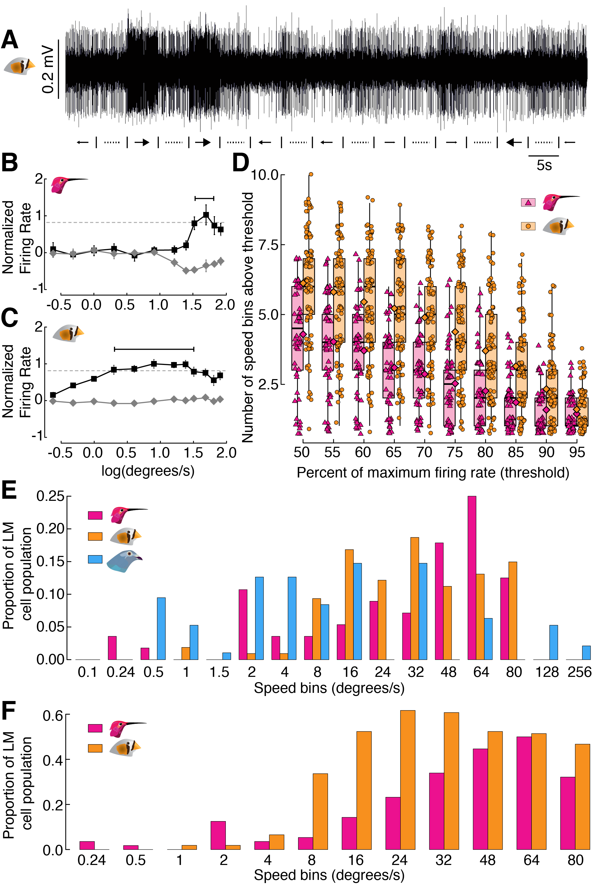

# Welcome to the plotting exercises for BIOL 548L!
BIOL 548L is a graduate course at The University of British Columbia. All of the
materials on this site were developed for one of the workshops in this course,
which focuses on wrangling data in R for publication quality figures. We
highlight packages in the [`tidyverse`](https://www.tidyverse.org/) and
ultimately build towards developing multi-panel plots via
[`cowplot`](https://github.com/wilkelab/cowplot).

Please see the vignettes in the drop-down menu above.

## Over three vignettes, we make this entire figure via code:

